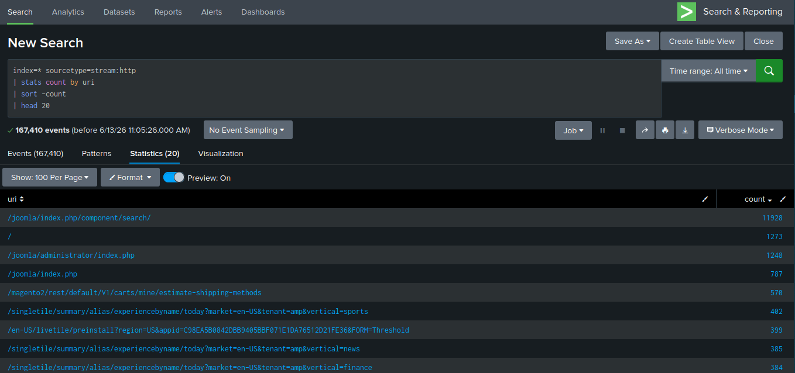
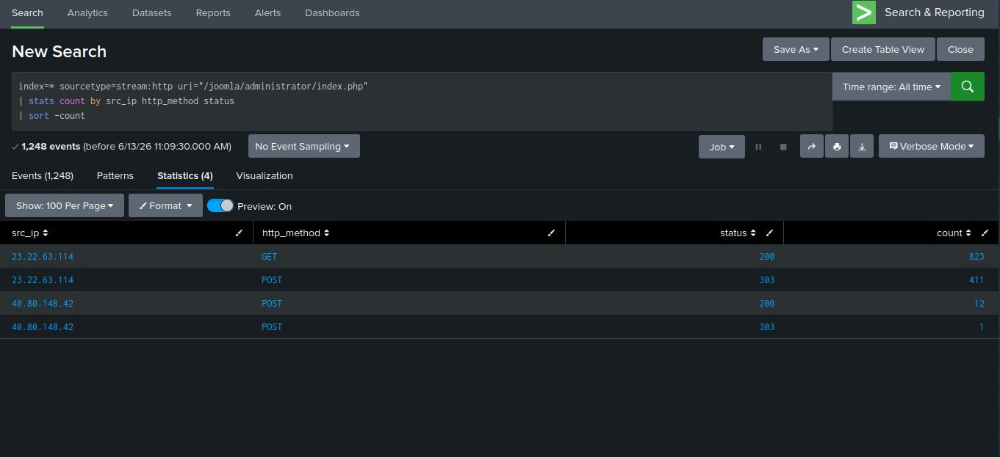
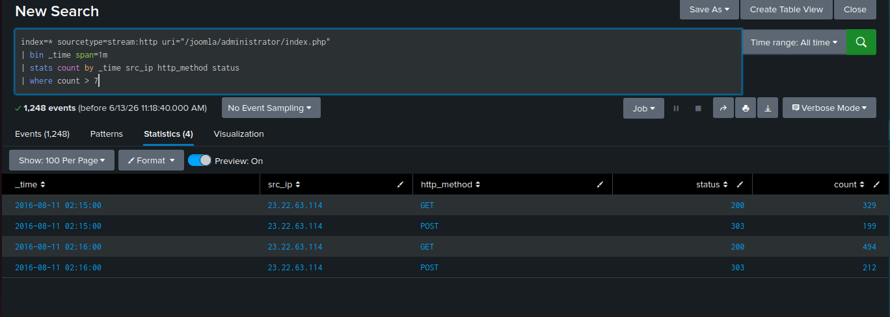

# Detection: Web Application Brute Force

**Log Source:** `stream:http`  
**MITRE ATT&CK:** T1110 — Brute Force  
**Target:** Joomla Admin Login (`/joomla/administrator/index.php`)

---

## Detection Logic

### Step 1 — Identify High-Volume Login Attempts
```spl
index=* sourcetype=stream:http uri="/joomla/administrator/index.php"
| bin _time span=1m
| stats count by _time src_ip http_method status
| where count > 7
```
**Threshold:** More than 7 requests per minute to the admin 
login page from a single IP.

**Findings:**
- Attacker IP: `23.22.63.114`
- Volume: ~200 POST + ~300 GET requests per minute
- Duration: At least 2 minutes (2016-08-11 02:15–02:16)
- Only `23.22.63.114` exceeded threshold — `40.80.148.42` 
  (13 total requests) confirmed as legitimate admin traffic

### Step 2 — Confirm Attack Outcome
```spl
index=* sourcetype=stream:http src_ip="23.22.63.114" 
uri="/joomla/administrator/index.php"
| table _time http_method status uri
| sort _time
```
**Findings:**
- URI never changed after POST attempts — no redirect to 
  admin dashboard
- Attack failed — no successful authentication confirmed

---

## Attack Pattern
The attacker alternated GET → POST requests against the Joomla 
admin login page. The GET requests likely retrieved fresh CSRF 
tokens required for each login submission — a pattern consistent 
with automated brute force tools (e.g., Hydra http-form-post). 
All POST attempts returned 303 redirects back to the login page, 
confirming repeated failed authentication.

---

## Analyst Conclusion
Automated brute force attack detected against the Joomla admin 
panel from `23.22.63.114`. Attack did not result in successful 
authentication. Source IP should be blocked and investigated 
for activity against other endpoints.

---

## Screenshots



