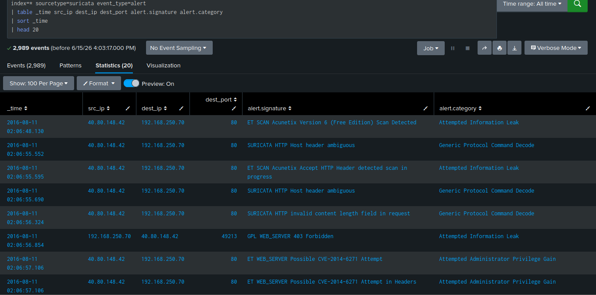
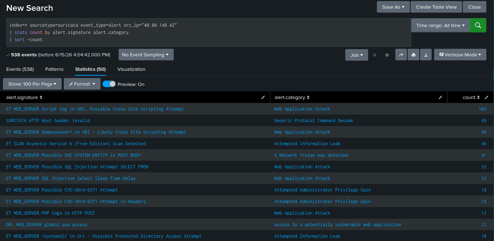
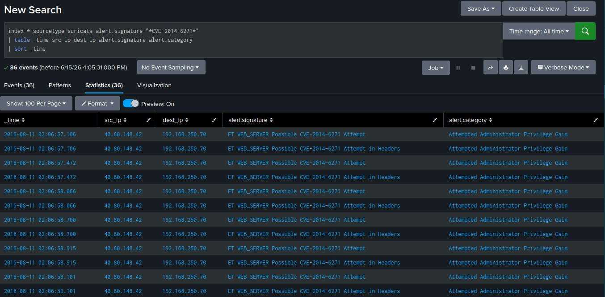
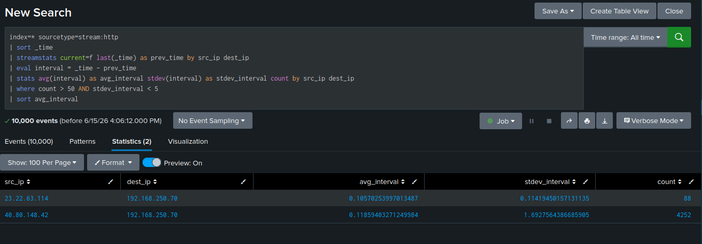
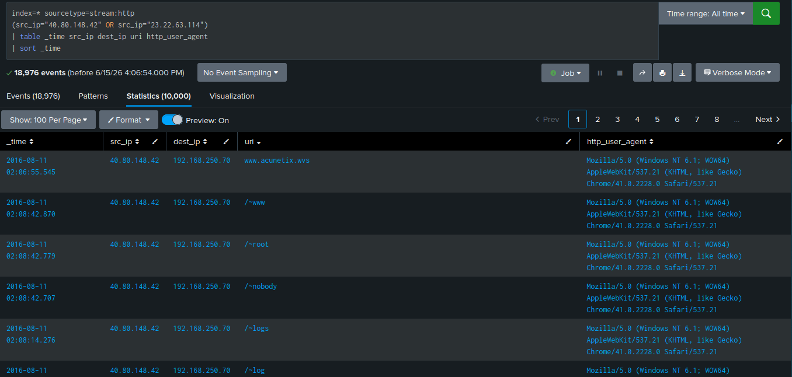

# Detection: C2 Beaconing Investigation & Multi-Stage Attack Analysis

**Log Sources:** `stream:http`, `suricata`  
**MITRE ATT&CK:** T1071 (Application Layer Protocol), 
T1190 (Exploit Public-Facing Application)  
**Target Host:** `192.168.250.70`

---

## Overview
Investigation into potential C2 beaconing activity revealed 
two separate attackers targeting the same host on 2016-08-11. 
No classic beaconing pattern was confirmed — instead, automated 
scanner and exploit activity was identified.

---

## Phase 1 — Suricata Alert Triage

Initial review of all Suricata IDS alerts to identify 
malicious activity across the environment.



**Finding:** Two source IPs flagged — `40.80.148.42` and 
`23.22.63.114` — both targeting `192.168.250.70:80`.

---

## Phase 2 — Acunetix Scanner Detection

Suricata identified `40.80.148.42` running Acunetix, a web 
application vulnerability scanner. This indicates deliberate 
reconnaissance against the target web server.



**Finding:** Multiple Acunetix signatures fired including 
HTTP header anomalies and protocol decode alerts — consistent 
with automated vulnerability scanning.

---

## Phase 3 — Shellshock Exploitation Attempt (CVE-2014-6271)

Suricata detected 36 Shellshock attempts from `40.80.148.42` 
against `192.168.250.70`. Shellshock is a critical Bash 
vulnerability allowing remote command execution via malicious 
HTTP headers — no file upload required.

```spl
index=* sourcetype=suricata alert.signature="*CVE-2014-6271*"
| table _time src_ip dest_ip alert.signature alert.category
| sort _time
```



**Finding:** All 36 events categorized as "Attempted 
Administrator Privilege Gain" — attempts detected but 
successful exploitation not confirmed from network data alone.

---

## Phase 4 — Beaconing Analysis

Applied statistical analysis to identify C2 beaconing 
patterns using `streamstats` to calculate connection 
intervals between IP pairs.

```spl
index=* sourcetype=stream:http
| sort _time
| streamstats current=f last(_time) as prev_time by src_ip dest_ip
| eval interval = _time - prev_time
| stats avg(interval) as avg_interval 
  stdev(interval) as stdev_interval count 
  by src_ip dest_ip
| where count > 50 AND stdev_interval < 5
| sort avg_interval
```



**Finding:** No classic beaconing pattern identified. Both 
flagged IP pairs showed avg_interval under 0.2 seconds — 
consistent with automated scanners running at maximum speed, 
not malware checking in at calculated intervals.

| Pattern | avg_interval | stdev | Conclusion |
|---|---|---|---|
| Classic C2 beacon | 30–300s | Very low | Not present |
| Scanner/fuzzer | <1s | Low–medium | Confirmed |

---

## Phase 5 — Two Attacker Attribution

Compared both attacker IPs side by side to determine if 
they were the same actor.

```spl
index=* sourcetype=stream:http 
(src_ip="40.80.148.42" OR src_ip="23.22.63.114")
| table _time src_ip dest_ip uri http_user_agent
| sort _time
```



**Finding:** Different user-agent strings confirm two 
separate actors:

| IP | User-Agent | Tools | Technique |
|---|---|---|---|
| `40.80.148.42` | Mozilla | Acunetix | Web scanning + Shellshock |
| `23.22.63.114` | Python script | Custom script | Automated brute force |

---

## Attack Timeline

| Time | Actor | Activity |
|---|---|---|
| 02:06 | `40.80.148.42` | Acunetix scan + Shellshock attempts |
| 02:15 | `23.22.63.114` | Joomla admin brute force begins |
| 02:41 | `23.22.63.114` | Last observed connection |

---

## Analyst Conclusion
No C2 beaconing confirmed in this dataset. Investigation 
revealed two independent attackers targeting the same host. 
`40.80.148.42` conducted web vulnerability scanning and 
attempted Shellshock exploitation. `23.22.63.114` ran 
automated brute force against Joomla admin panel (previously 
documented). Both attacks targeted `192.168.250.70` on port 80.

**Recommended actions:**
- Block both source IPs at perimeter firewall
- Patch Bash to remediate Shellshock (CVE-2014-6271)
- Investigate `192.168.250.70` for signs of successful 
  Shellshock exploitation via host-based logs
