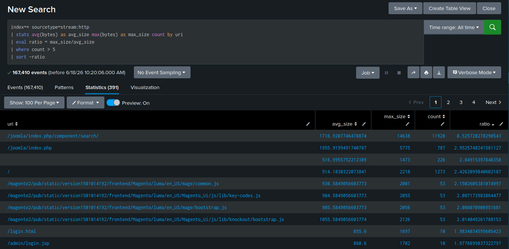
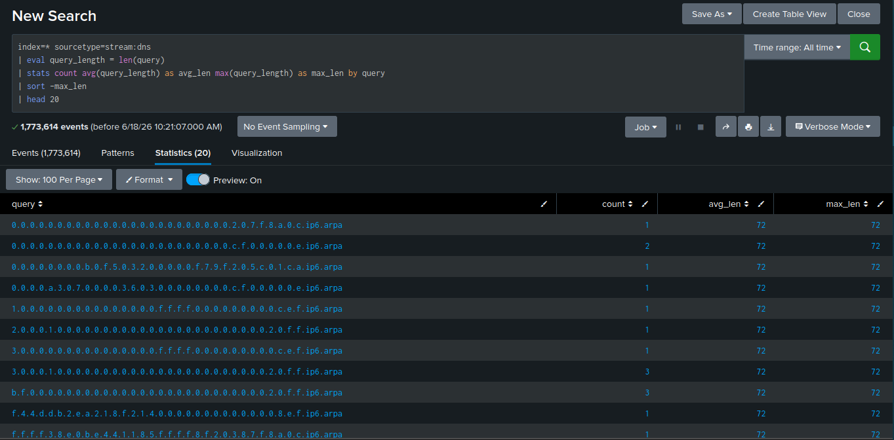
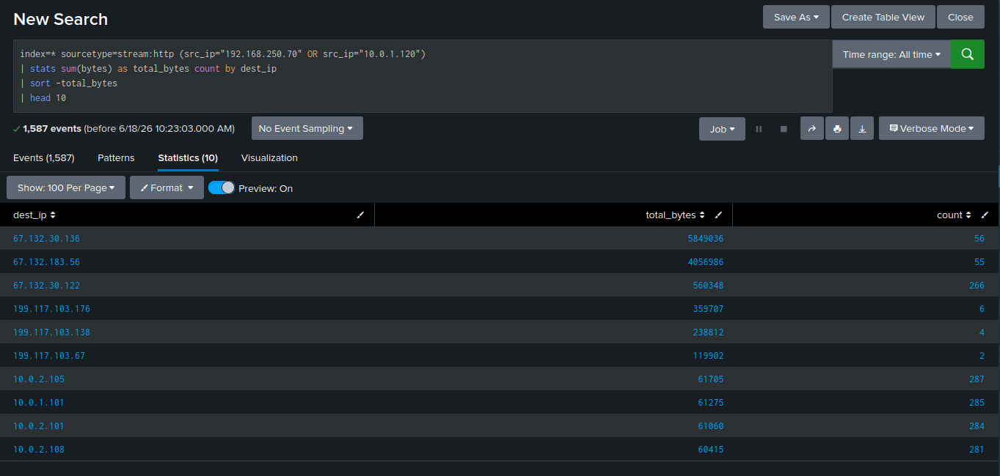
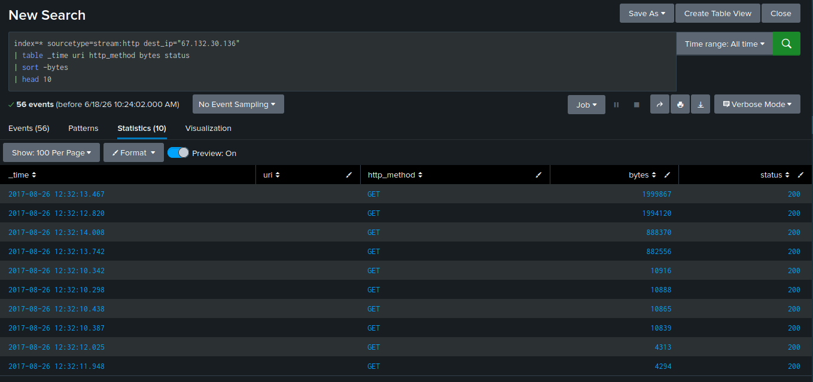
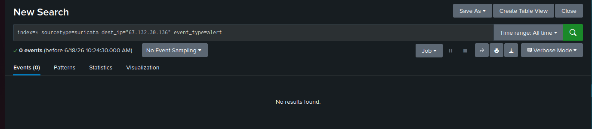

# Investigation: Data Exfiltration Hunt

**Log Sources:** `stream:http`, `stream:dns`, `suricata`  
**MITRE ATT&CK:** T1041 (Exfiltration Over C2 Channel), 
T1048 (Exfiltration Over Alternative Protocol)  
**Status:** Inconclusive — no confirmed exfiltration

---

## Overview
Investigated three potential data exfiltration vectors: 
abnormal HTTP response sizes, DNS tunneling, and outbound 
data volume to external IPs. No confirmed exfiltration was 
identified, but methodology and findings are documented 
below.

---

## Phase 1 — HTTP Response Size Anomaly

Compared average vs. maximum response size per URI to 
identify endpoints returning abnormally large responses 
(based on prior finding in Juicy Details CTF where a 
10x+ size spike indicated SQL injection data theft).

```spl
index=* sourcetype=stream:http
| stats avg(bytes) as avg_size max(bytes) as max_size count by uri
| eval ratio = max_size/avg_size
| where count > 5
| sort -ratio
```



**Finding:** Highest ratio observed was 8.5x (Joomla search 
endpoint) — well below the threshold expected for a genuine 
exfiltration outlier. No significant anomaly found.

---

## Phase 2 — DNS Tunneling Check

Checked DNS query lengths for unusually long or encoded-looking 
subdomains, a common indicator of DNS-based data exfiltration.

```spl
index=* sourcetype=stream:dns
| eval query_length = len(query)
| stats count avg(query_length) as avg_len max(query_length) as max_len by query
| sort -max_len
| head 20
```



**Finding:** No abnormally long or randomized DNS queries 
identified. No evidence of DNS tunneling in this dataset.

---

## Phase 3 — Outbound Volume to External IPs

Checked total data volume sent from known targeted hosts 
(`192.168.250.70`, `10.0.1.120`) to all destination IPs, 
looking for disproportionate transfers to external addresses.

```spl
index=* sourcetype=stream:http (src_ip="192.168.250.70" OR src_ip="10.0.1.120")
| stats sum(bytes) as total_bytes count by dest_ip
| sort -total_bytes
| head 10
```



**Finding:** External IP `67.132.30.136` received 5.8MB across 
only 56 connections — disproportionately high compared to 
internal traffic patterns (~60KB across 280+ connections).

---

## Phase 4 — Suspicious Destination Investigation

Investigated the flagged external IP directly to identify 
what was being transferred.

```spl
index=* sourcetype=stream:http dest_ip="67.132.30.136"
| table _time uri http_method bytes status
| sort -bytes
| head 10
```



**Finding:** Two GET requests transferred ~2MB each within a 
4-second window. `uri` field was empty for all requests — 
consistent with a recurring pattern observed elsewhere in this 
dataset (non-standard or unlabeled traffic).

---

## Phase 5 — Suricata Cross-Check

Cross-referenced the flagged destination against Suricata 
alerts to check for IDS detection.

```spl
index=* sourcetype=suricata dest_ip="67.132.30.136" event_type=alert
```



**Finding:** No Suricata alerts triggered for this destination. 
Traffic was logged as standard port 80 HTTP (`stream:http`, 
`stream:tcp`, `suricata flow` events) — not flagged as malicious 
by IDS signatures.

---

## Analyst Conclusion
No confirmed data exfiltration identified through HTTP size 
analysis, DNS tunneling indicators, or outbound volume review. 
One anomaly — large GET transfers to `67.132.30.136` with no 
URI captured — was identified but could not be confirmed as 
malicious due to missing application-layer context and no 
corresponding IDS alert.

**Recommendation:** In a live environment, this traffic would 
warrant manual review of full packet capture (PCAP) to 
determine actual content and protocol, since metadata alone 
was insufficient to confirm or rule out exfiltration.

---

## Key Takeaway
Not every investigation produces a confirmed detection. Ruling 
out exfiltration vectors through structured analysis — and 
clearly documenting what was checked and why — is itself 
valuable analyst work and demonstrates a repeatable 
investigative methodology.
